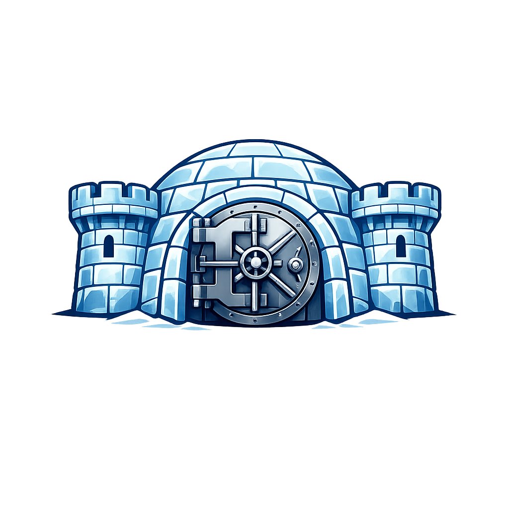

  
  <h1 style="margin-top: 2px; margin-bottom: 0; font-size: 2.5em;">Frozen Fortress</h1>

Frozen Fortress is a **lightweight secret and document manager** designed for local self-hosting. Built with **Go**, it provides a secure, simple, and pragmatic solution for storing and managing sensitive information like passwords, secrets, and documents in a local environment.

## 🎯 What is Frozen Fortress?

Frozen Fortress is designed to help individuals and small teams manage their sensitive data locally without relying on cloud services. It provides:

- **Secret Management**: Store and organize passwords, API keys, and other sensitive information
- **Document Management**: Store and organize documents with OCR support for text extraction
- **User Management**: Multi-user support with authentication and authorization
- **Web Interface**: Modern web UI for easy interaction
- **CLI Tools**: Command-line interface for administrative tasks
- **Backup System**: Automated backup functionality to protect your data
- **OCR Support**: Best-effort asynchronous text extraction from images and PDFs using Ollama, with optional Tesseract fallback

## 🏗️ Architecture & Tech Stack

Frozen Fortress is built with **simplicity and pragmatism** as core driving principles.

- **Backend**: Go 1.24.3
- **Database**: SQLite 3
- **Session Storage**: Redis
- **Web Framework**: Gin
- **CLI Framework**: Cobra
- **OCR**: Ollama \`glm-ocr:q8_0\` for image OCR, PDF text extraction in-process, optional Tesseract fallback
- **Deployment**: Docker Compose (recommended) — nginx + WebUI + Redis + Ollama on a dedicated Docker network

## 🚀 Quick Start

Docker and Docker Compose are the recommended and supported deployment method. No Go installation, Redis setup, or manual dependency management required.

### Prerequisites

- **Docker** 24+ and **Docker Compose** v2

### 1. Start the stack

\`\`\`bash
docker compose up -d
\`\`\`

The Compose stack starts four services on a private \`frozenfortress\` Docker network:

| Service  | Purpose                                          | Default host exposure   |
|----------|--------------------------------------------------|-------------------------|
| \`nginx\`  | HTTPS entrypoint, SSL termination, reverse proxy | \`127.0.0.1:8443\`        |
| \`webui\`  | Frozen Fortress web application                  | Internal network only   |
| \`redis\`  | Session store                                    | Internal network only   |
| \`ollama\` | GLM OCR inference                                | Internal network only   |

### 2. Create your first user

\`\`\`bash
docker compose exec webui /app/ffcli user create <username> <password>
docker compose exec webui /app/ffcli user activate <username>
\`\`\`

### 3. Open the web UI

Navigate to \`https://127.0.0.1:8443\`. On first use, accept the self-signed certificate warning (see the [Docker Setup Guide](doc/setup-docker.md) for how to use your own certificate).

### Using an external Ollama instance

If you already have Ollama running elsewhere, skip the bundled container:

\`\`\`bash
FF_OCR_OLLAMA_URL=http://gpu-host:11434 docker compose up -d
\`\`\`

---

## 📖 Setup Guides

| Guide | Description |
|-------|-------------|
| [Docker Setup Guide](doc/setup-docker.md) | Full reference for the recommended Docker deployment — TLS certificates, configuration variables, CLI administration, backup and restore |
| [Binary Setup Guide](doc/setup-binary.md) | Legacy guide for running Frozen Fortress directly on a host system without Docker |
| [Binary to Docker Migration Guide](doc/migration-binary-to-docker.md) | Step-by-step instructions for migrating an existing binary installation to the Docker stack |

---

## 👩🏻‍💻 Web User Interface

The WebUI provides a modern interface for daily use:

- **Secrets**: Create, edit, and organize passwords, API keys, and other sensitive information
- **Documents**: Upload and manage documents with asynchronous OCR text extraction
- **Tags**: Organize content with a flexible tag system
- **Account Settings**: Password changes, recovery codes, and account management

### User Registration Workflow

1. New users register via the web UI registration form
2. An administrator activates the account via the CLI: \`ffcli user activate <username>\`
3. The user can then sign in

Alternatively, administrators can create users directly via the CLI.

---

## 🔐 Security

- **Data Encryption**: All sensitive data is encrypted at rest using user-specific Master Encryption Keys (MEK) derived from user passwords
- **Zero-Knowledge Architecture**: Even administrators cannot access encrypted user data without the user's password
- **Secure Sessions**: Session-based authentication with secure cookies backed by Redis
- **Account Lockout**: Protection against brute force attacks
- **Recovery Codes**: Secure account recovery mechanism
- **HTTPS by Default**: The Docker stack enforces HTTPS via nginx; the Go application runs HTTP only on the internal Docker network

---

## 🤝 Contributing

Contributions are welcome. Please submit issues, feature requests, or pull requests.

### Development Workflow

1. Install development dependencies: \`./install-dev-deps-debian.sh\` or \`./install-dev-deps-fedora.sh\`
2. Make your changes
3. Build and test: \`./build-all.sh\`
4. Submit a pull request

---

## 📄 License

This project is licensed under the **MIT License**. See the [LICENSE](LICENSE.md) file for details.

------

© 2026 Yetibyte
